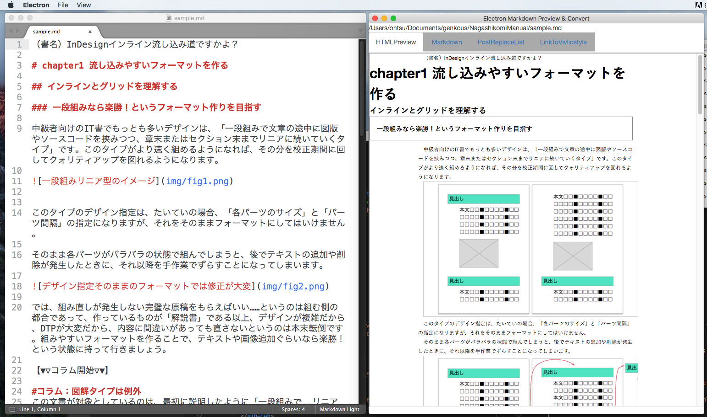

# mdpreview
 Markdown Preview and Convert to HTML with Electron.

## 概要
Electronで作成したMarkdownプレビューアプリです。grunt-markdownで行っていたHTML変換タスクの代替として作成しているので、いったんHTMLファイルを書き出してから読み込んで表示するという特徴を持ちます。

その際に`_template.html`というHTMLのテンプレートファイルを読み込む仕様なので、
テンプレートファイルにCSSの読み込みを書いておけば、任意のCSSを読み込んでプレビュー表示することができます。

最終的にはVivliostyleを利用した書籍形式でのプレビューへの対応と、InDesign向けのXMLファイル書き出しをサポートする予定です。

