【▼▽カバーページ▽▼】
# サンプルドキュメント

章リード１２３４５６７８９●１２３４５６７８９●１２３４５６７８９●１２３４５６７８９●１２３４５６７８９●１２３４５６７８９●１２３４５６７８９●１２３４５６７８９●１２３４５６７８９●（120字）

【▲△カバーページ△▲】

【▼▽セクションヘッダー▽▼】
## インラインとグリッドを理解する
本文や画像のパーツをバラバラのフレームにしていると、後からの修正対応が大変になります。ここでは本文中に画像を挿入する作業を例にして、インラインとグリッドを活用して効率よく組版する方法を説明します。

【▲△セクションヘッダー△▲】

### 一段組みなら楽勝！というフォーマット作りを目指す

中級者向けのIT書でもっとも多いデザインは、「一段組みで文章の途中に図版やソースコードを挟みつつ、章末またはセクション末までリニアに続いていくタイプ」です。
このタイプがより速く組めるようになれば、その分を校正期間に回してクォリティアップを図れるようになります。


- リスト1： アイテムです。
- リスト2： アイテムです。
- リスト3： アイテムです。
- リスト4： アイテムです。

このタイプのデザイン指定は、たいていの場合、「各パーツのサイズ」と「パーツ間隔」の指定になりますが、それをそのままフォーマットにしてはいけません。

そのまま各パーツがバラバラの状態で組んでしまうと、後でテキストの追加や削除が発生したときに、それ以降を手作業でずらすことになってしまいます。


では、組み直しが発生しない完璧な原稿をもらえばいい……というのは組む側の都合であって、作っているものが「解説書」である以上、デザインが複雑だから、DTPが大変だから、といった理由で内容に間違いがあっても直さないというのは本末転倒です。組みやすいフォーマットを作ることで、テキストや画像追加ぐらいなら楽勝！という状態に持って行きましょう。


### InDesignのインライン機能を見直す
もともとInDesignは、テキストフレームをリンクさせて複数ページに流し込む機能を持っています。しかし、小説のような文字ばかりの本でしか使えないと思っている人が多いのではないでしょうか？　実は「インライン機能」を使いこなせば、かなり凝ったデザインの本でも、リンクしたテキストフレームを使って組むことができます。

インライン機能はテキスト中に他のオブジェクト（フレーム）を挿入する機能ですが、InDesignでは「インラインオブジェクト」と「アンカー付きオブジェクト」の2種類に分かれます。

#### インラインオブジェクト

テキスト中に挿入したフレームを右クリックし、［アンカー付きオブジェクト］→［オプション］を選択すると［アンカー付きオブジェクトオプション］ダイアログボックスが表示されます。

ここで［インラインまたは行の上］の［インライン］を選んだ状態がインラインオブジェクトです。


結果を見るとわかるように、文字とまったく同じ扱いになり、オブジェクトのサイズに応じて周りの文字は追い出されます。ただし、回り込みの設定と違って、複数行のテキストがオブジェクトの横に回り込むことはありません。テキスト中の1文字を大きくした場合と同じ状態になります。

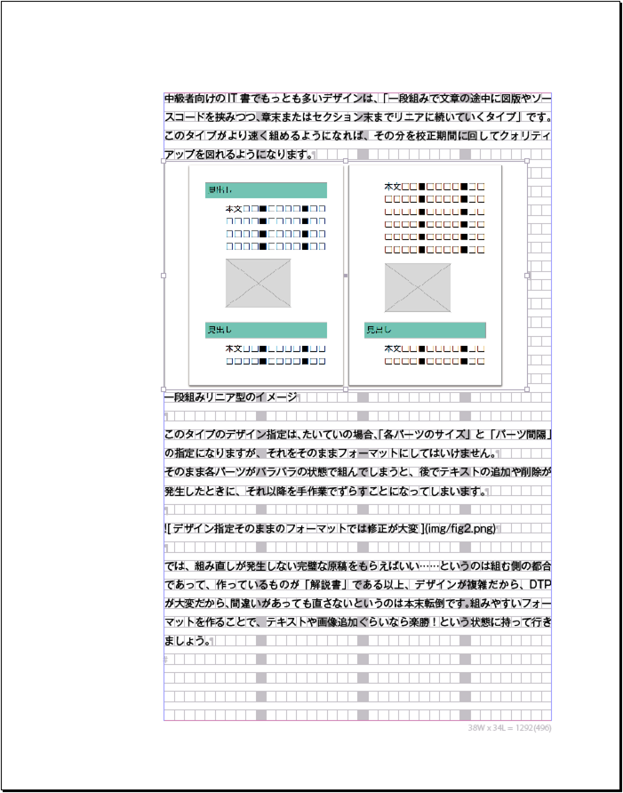

なお、「行の上」という設定もありますが、使ったことがないので割愛します。

インラインにしたときにオブジェクトが他の行に重なってしまう場合は、おそらくインラインにした段落のスタイルで行送りが設定されているはずです。行送りを「自動」にしておけば、オブジェクトのサイズに合わせて行が広がります。

#### アンカー付きオブジェクト

［アンカー付きオブジェクトオプション］ダイアログボックスで［カスタム］を選んだ状態が、アンカー付きオブジェクトです。インラインよりも設定項目が増え、配置の自由度が上がっています。


結果を見ると、本文と図版にイカリのマークが付き、本文フレームの外に図版が飛び出しています（配置される場所はオプション設定によって変わります）。テキストには影響ありません。

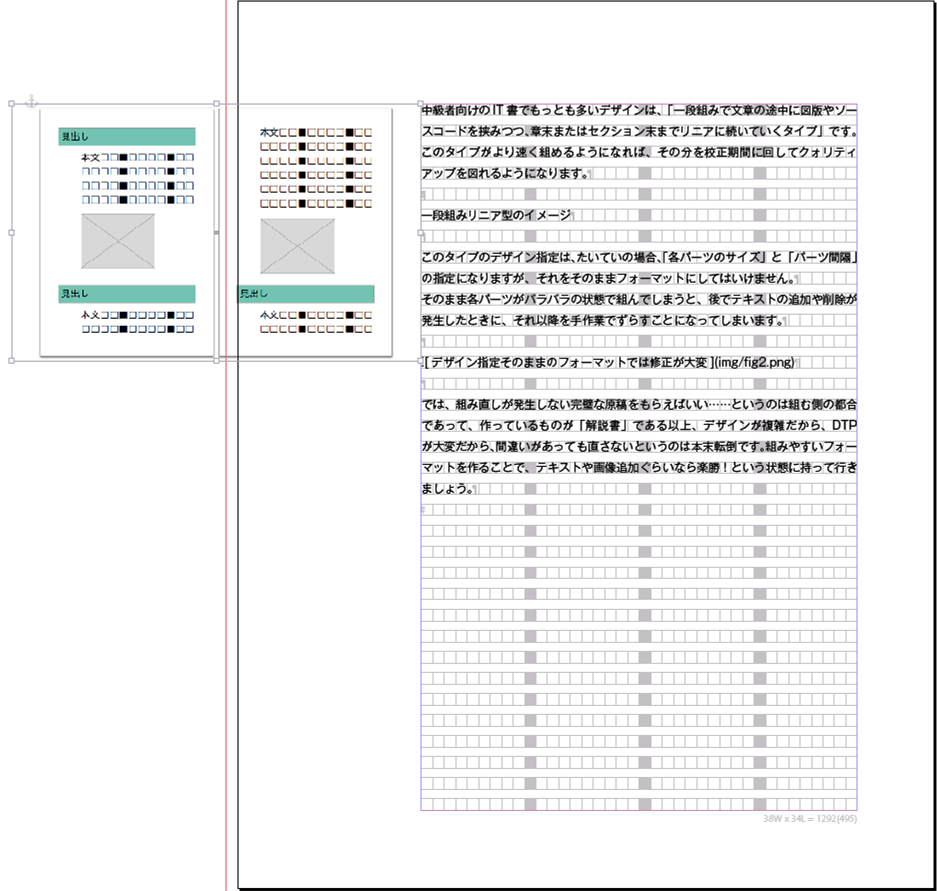


2つの設定のうち、メインで使用するのはインラインのほうです。アンカー付きオブジェクトは細かい設定ができますが、その分コントロールが難しくなります。オブジェクトと本文が重ならないようにしたい場合は、回り込み設定を組み合わせなければいけません。また、ページをまたぐ位置に来たときにオブジェクトが見えなくなったり、うっかりアンカー文字を削除してオブジェクトを消してしまったりするトラブルも起きやすくなります。

アンカー付きオブジェクトを使うのは、オブジェクトの横に本文を回り込ませたいときか、セクションタイトルもインライン扱いにしたいときぐらいです。基本的には単純なインラインを使うことにしたほうが、トラブルが少なくなります。

## ソースコードを表組みで作る
ソースコード枠に表組みを利用すると、複数ページにまたがるソースコード枠でも簡単に作れるようになります。ここでは合成フォントの作成や欧文組版ルールの解除といったソースコードを組むために必要な基礎知識もあわせて解説します。


### ソースコードの文字設定
まず基本の文字スタイルについて説明します。ソースコードは原則等幅なので、フォントは、Courier New、Andale mono、Inconsolata、Source Code Proなどの等幅欧文フォントをベースにした合成フォントとなります。ただしそれで終わりではありません。これは最低限のことでしかなく、半角スペースで正確に文字揃えできるように、通常の和欧混淆文用とは設定を変えなければいけないのです。

まず、合成フォントを作る時に和欧の横幅を変えると揃わなくなります。サイズを調整したい場合は、欧文を縦にちょっと引き延ばす程度がおすすめです。

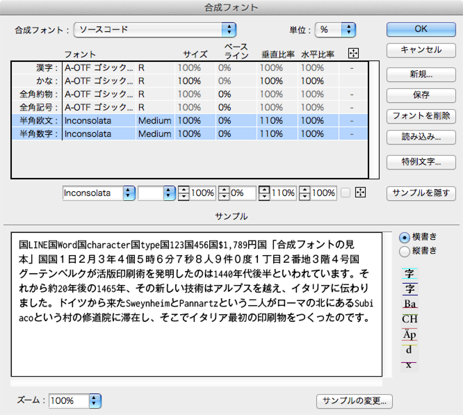

また、ソースコード用の文字組みアキ量設定を作成し、和欧文間をゼロ固定にします。

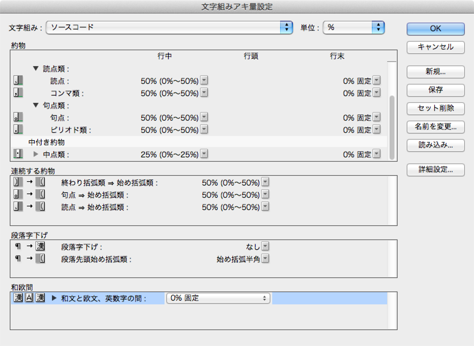

その他に、段落スタイルで［欧文合字］をオフにし、カーニングや字送りなどの字間を変える設定は原則使わないようにします。折り返しが少ないほうがいいので、文字サイズは少し落としておくといいでしょう。


折り返しが発生した場合に字間が広がらないように、行末揃えではなく左揃えを使用します。

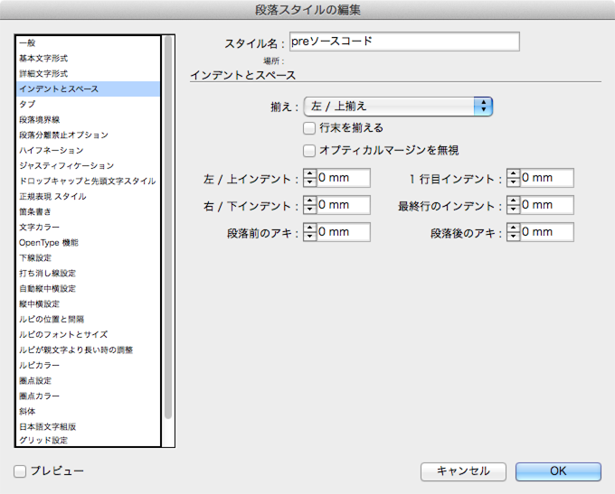

単語の途中で折り返しても問題ないようなら、［欧文泣き別れ］をオンにしてもいいでしょう。ただし、誤読の原因になる（2単語だと誤解される）こともあるので、この設定を使うかどうかはよく検討してください。

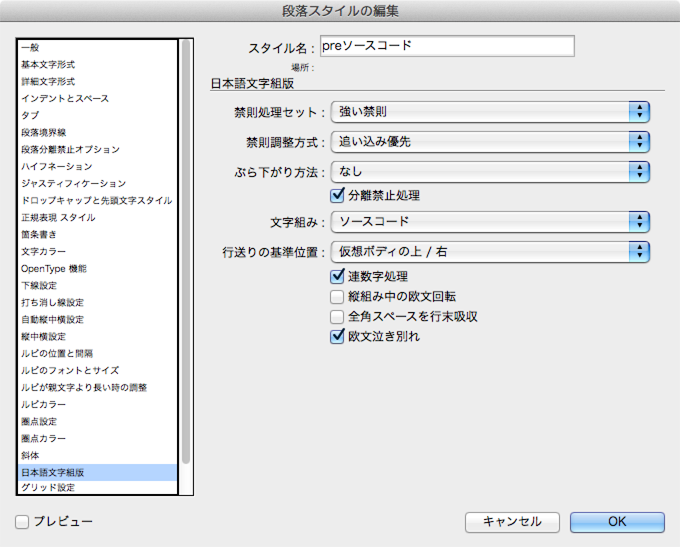

最後に和欧混交のソースコードのサンプルを入力し、半角スペースで揃えられることを確認します。


可能であれば、その本の対象となるプログラミング言語のサンプルを著者からもらって流し込み、問題が起きないことを確認してください。

### 表組みに変換する
それではソースコードを表に変換し、セルスタイルと表スタイルを作成して見た目を整えていきます。まずはソースコードの範囲を選択し、［表］メニューの［ソースコードを表に変換］を選択します。区切り文字はソースコード中にタブが使われていなければ、初期設定のタブと改行でOKです。使われている場合は、ソースコードの中で使われていそうもない文字を指定してください。

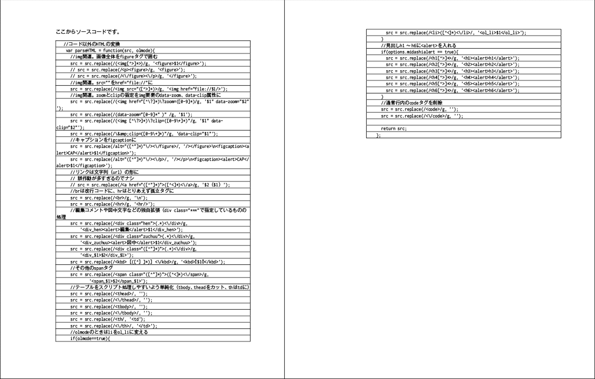

地味目な表に変換されたので、見た目を整えていきましょう。セルスタイルを作成してセル内マージンを設定します。


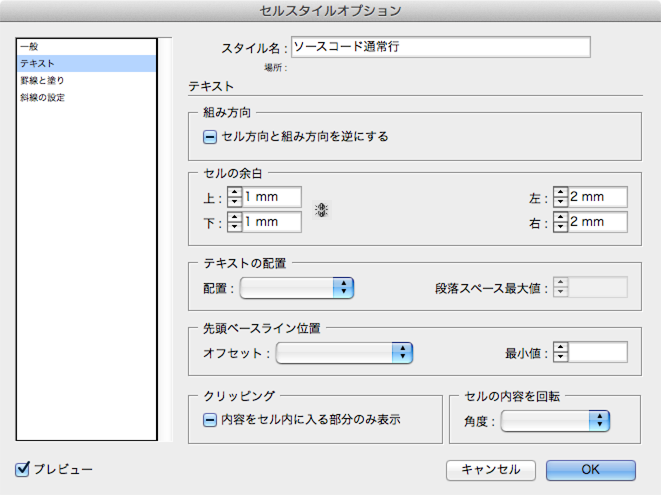

セルスタイルを使って、罫線や背景色を設定することもできますが、その場合、表スタイル側の設定がオーバーライドされてしまいます。つまり、**表スタイルによる外枠の設定や交互に背景を塗りつぶす設定などが使えなくなる**ということです。今回は表スタイル側で罫線と背景色の設定を行うことにします。

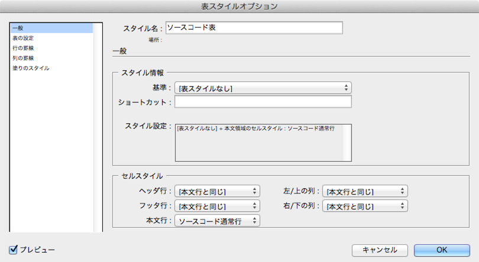

表の境界線（外枠の罫線）の設定を行い、［表と段落のアキ］を0mmにします。［表と段落のアキ］は表の上下に空きを作るための設定ですが、今回はインライン親行用の段落スタイルを作るので計算が狂わないよう空きをなくしています。

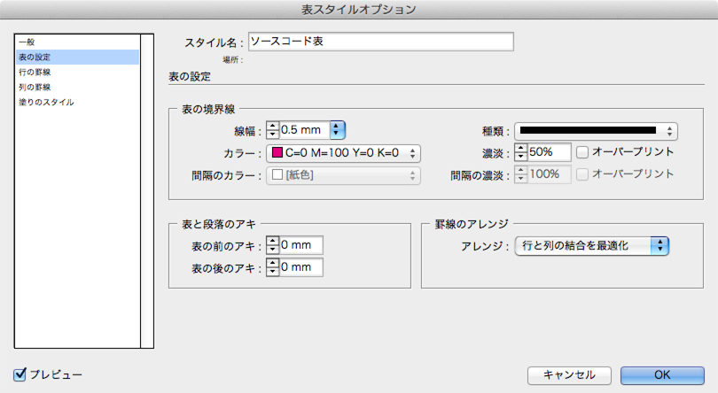

続いて各行の間に、0.5mmの白い罫線を引きます。表スタイルでは交互にする設定しか行えないので、2行とも同じ設定にします。

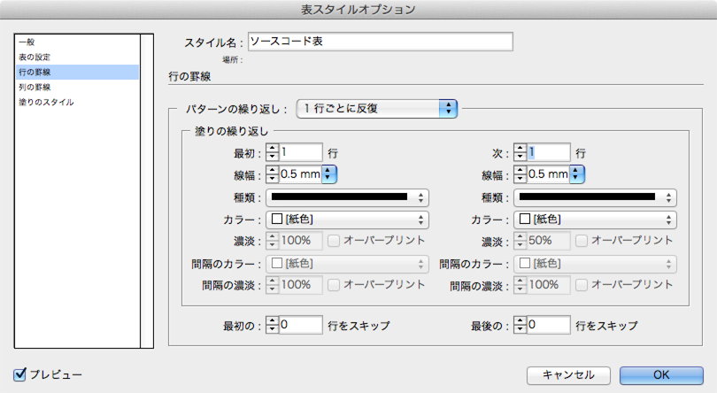

最後に塗りのスタイルを設定します。ここでは薄い黄色とグレーで交互に背景を塗りつぶす設定とします。

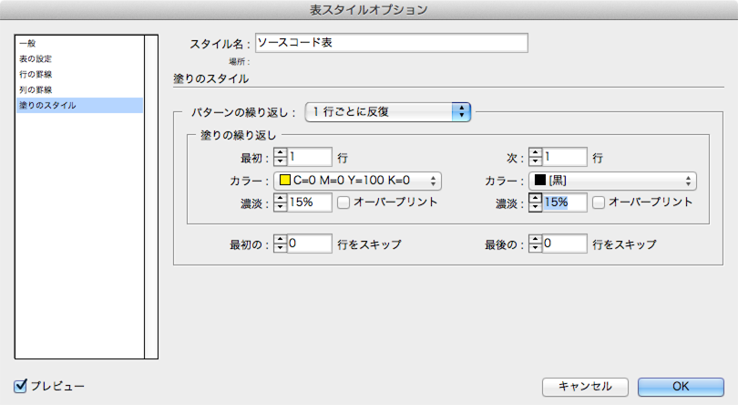

これで見た目がほぼできあがりました。

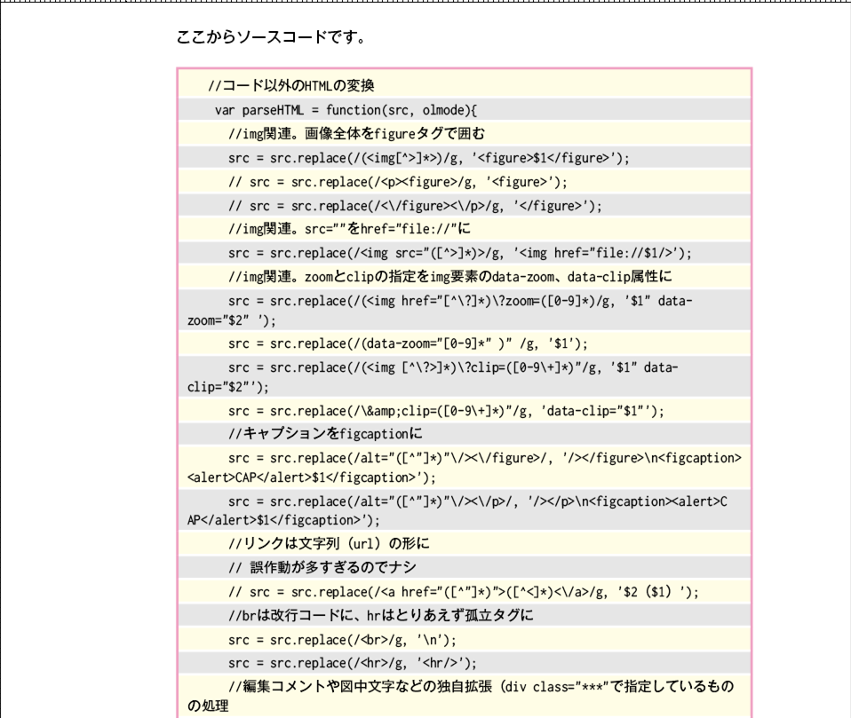


### 表の先頭行と最終行だけスタイルを変える
先頭行と最終行は表の外枠とテキストの間隔が狭いので、そこだけセルスタイルを作成して調整します。

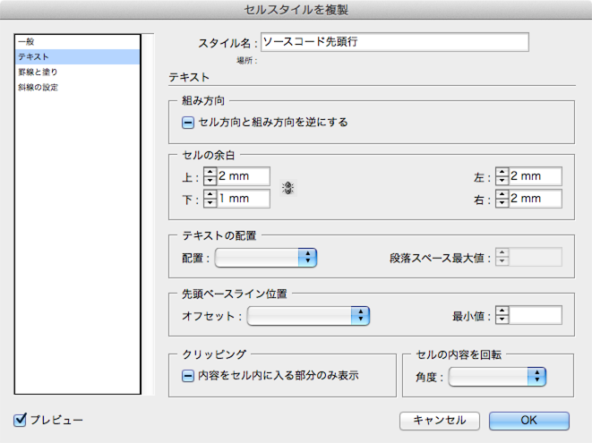

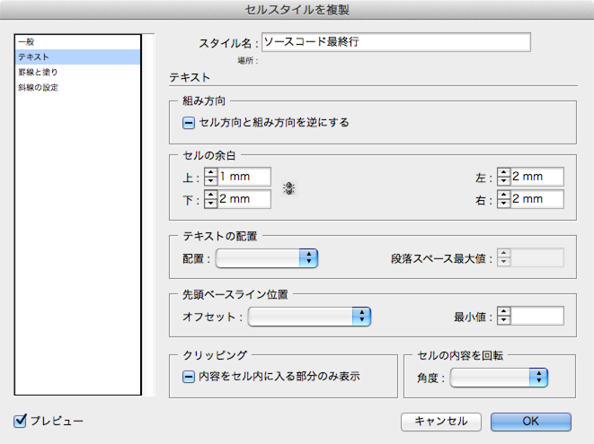

これを手作業で設定するのは面倒なので、後半ではスクリプトで自動設定を行う方法を解説します。


【▼▽セクションヘッダー▽▼】
## このマニュアルで解説する方式の概要

ここからはMarkdown原稿をHTMLやXMLに変換し、InDesignに流し込んで各スタイルの設定や画像の読み込み、ソースコード枠・表組みを自動で処理する方法を解説します。まずはその概要から説明しましょう。

【▲△セクションヘッダー△▲】

### 最初の組みの効率をアップする

ここまで説明してきたインラインを活用した方法で変更・修正は効率化できますが、最初に組むときの手間は変わりません。ここからはMarkdownとXML読み込み機能を利用して、最初の組みを大幅に効率アップする方法を解説します。

元原稿の状態や、フォーマットデザインの複雑さ、作図が必要かどうかなどによって、作業時間は変わってきてしまうのですが、**スタイル設定**と**図版挿入**、**表作成**、**コードの色分け**がほぼ自動で完了するため、大幅な改善が見込めるのは間違いありません。


### Markdownプレビューのカスタマイズ
Markdownプレビューの外観を書籍の仕上がりに近づけておけば、いちいちInDesignで組まなくてもブラウザ上で仕上がりイメージを把握しやすくなります。

プロジェクトフォルダ内の「mytemplate.html」を開いてみてください。このHTMLファイルはgrunt-markdownがHTML変換するときのテンプレートで、ここで参照するCSSファイルやJavaScriptファイルなどを指定します。Markdown原稿とCSS・JSファイルの相対位置が変わった場合は、正しく参照されるようパスを変更しておく必要があります。

cssjsというフォルダ内にあるmyrule.cssというCSSファイルが、プレビューの外観を決めています。書籍のデザインに合わせて適当に書き換えてください。


###### mytemplate.html

```html
<!DOCTYPE  html>
<html>
  <head>
    <meta charset="utf-8">

    <title>doc</title>
    <script src="../cssjs/jquery-2.0.3.min.js"></script>
    <script src="../cssjs/addimagename.js"></script>
    <link rel="stylesheet" href="../cssjs/myrule.css">
  <link rel="stylesheet" href="../cssjs/hljsstyles/xcode.css">
  </head>
  <body>
    <%=content%>
  </body>
</html>
```

###### myrule.css
```css
div.chapter{
  margin-top: 3em;
  font-size: 2.5em;
  border-top:solid 4px #F08;
  border-bottom:solid 4px #F08;
}

div.hen{background: #ff0; color:#D00; font-size: 0.7em;}

img {
  display:block;
  border: solid 1px #444;
  max-width:600px;
}
blockquote{
  font-weight: bold;
    background:#ff0;
    margin: 1em 0;
    padding-left: 1em;
}
body {
    font-family:sans-serif;
    width:36em;
}
……後略……
```

###### フォルダ構成

|ファイル・フォルダ名|説明
|--|--
|cssjs| プレビュー用のCSSとJavaScriptファイルを入れておくフォルダ（P.■■参照）。
|doc| Markdown原稿を入れるフォルダだが、リネームしてもいいし、このフォルダ外に原稿を置いても問題ない。
|Gruntfile.js| Gruntの設定ファイル。
|indesign-plugins | InDesign用のプラグイン（P.■■参照）。インストール後は削除しても問題ない。
|kousei-sjis | Just-Rightという校正ツールを使用するために、Shift JISに変換したHTMLファイルを保存しておくフォルダ。削除しても問題ない。
|mytemplate.html | プレビュー用HTMLの元になるテンプレートファイル。CSSへのリンクなどを記述しておく（P.■■参照）。
|node_modules | Gruntやプラグインがインストールされているフォルダ。
|README.html〜xml | 使用説明ファイル。削除しても問題ない。
|sample | テスト用のファイル。削除しても問題ない。
